# react-scroll-kit


Router-aware scroll management for React applications.

Automatic scroll restoration, navigation-aware scrolling, reusable hooks, utilities, and optional UI components for React Router apps.

<p align="center">
  
</p>

---

## Features

- Router-aware scroll management
- Automatic scroll restoration
- Reading progress bar
- Smooth scrolling utilities
- Scroll-to-top button
- Infinite scrolling hooks
- Scroll direction detection
- Scroll spy support
- IntersectionObserver utilities
- Container-aware scrolling support
- Reduced motion accessibility support
- SSR safe
- Lightweight and tree-shakeable

---

# Installation

Install package and peer dependencies:

```bash
npm install react-scroll-kit react react-router-dom
```

Using yarn:

```bash
yarn add react-scroll-kit react react-router-dom
```

Using pnpm:

```bash
pnpm add react-scroll-kit react react-router-dom
```

---

# Quick Start

Place `ScrollToTop` inside your React Router application.

```tsx
import { ScrollToTop } from 'react-scroll-kit';

function App() {
  return (
    <>
      <ScrollToTop />
      {routes}
    </>
  );
}
```

---

# Utilities API

## scrollTo

Programmatically scroll the page or a custom container.

```tsx
import { scrollTo } from 'react-scroll-kit';

scrollTo('#contact', {
  behavior:'smooth',
  duration:700,
  easing:'easeOutExpo',
  offset:80
});
```

### Options

| Option | Type | Default |
|---|---:|---:|
| behavior | smooth \| instant | instant |
| duration | number | 500 |
| easing | string \| function | easeOutQuad |
| offset | number | 0 |
| delay | number | 0 |
| scrollAxis | x \| y \| both | y |
| container | HTMLElement \| RefObject | window |
| respectReducedMotion | boolean | true |

---

## hashScroll

Smoothly scroll to URL hash elements.

```tsx
import { hashScroll } from 'react-scroll-kit';

hashScroll('#pricing');
```

---

## lockScroll / unlockScroll

Lock scrolling during modals or overlays.

```tsx
import {
 lockScroll,
 unlockScroll
} from 'react-scroll-kit';

lockScroll();

unlockScroll();
```

---

# Components

## ScrollToTop

Automatically scroll to top on route changes.

```tsx
<ScrollToTop
 behavior="smooth"
 duration={700}
 easing="easeOutExpo"
 excludeRoutes={['/exclusive']}
/>
```

Props:

| Prop | Type | Default |
|---|---:|---:|
| behavior | smooth \| instant | instant |
| duration | number | 500 |
| easing | string \| function | easeOutQuad |
| delay | number | 0 |
| scrollAxis | x \| y \| both | y |
| container | HTMLElement \| RefObject | window |
| excludeRoutes | string[] | [] |
| respectReducedMotion | boolean | true |

---

## ScrollRestoration

Restore previous page positions.

```tsx
<ScrollRestoration
 storageKey="app-scroll"
 container={contentRef}
/>
```

---

## ScrollProgressBar

Show page reading progress.

```tsx
<ScrollProgressBar
 height={4}
 color="linear-gradient(to right,#3b82f6,#10b981)"
 position="bottom"
 container={contentRef}
/>
```

Props:

| Prop | Type | Default |
|---|---:|---:|
| height | string \| number | 3 |
| color | string | #1565C0 |
| zIndex | number | 9999 |
| position | top \| bottom | top |
| container | HTMLElement \| RefObject | window |

---

## ScrollToTopButton

Display a floating button after scrolling.

```tsx
<ScrollToTopButton
 threshold={400}
/>
```

---

## ScrollLink

Navigation-aware scroll links.

```tsx
<ScrollLink
 to="/about#pricing"
 scrollTo="#pricing"
 scrollBehavior="smooth"
>
 Go to pricing
</ScrollLink>
```

---

# Scrollable Container Example

If your app uses:

```css
overflow-y:auto
```

pass the container reference.

```tsx
import { useRef } from 'react';

const contentRef = useRef(null);

return (
<>
   <ScrollProgressBar
      container={contentRef}
   />

   <ScrollToTop
      container={contentRef}
   />

   <main
      ref={contentRef}
      style={{
        height:'100vh',
        overflowY:'auto'
      }}
   >
      {children}
   </main>
</>
)
```

---

# Hooks

## useScrollPosition

```tsx
import {
 useScrollPosition
} from 'react-scroll-kit';

const {x,y} =
useScrollPosition();
```

---

## useScrollDirection

```tsx
import {
 useScrollDirection
} from 'react-scroll-kit';

const direction=
useScrollDirection({
 threshold:10
});
```

---

## useScrolledPast

```tsx
import {
 useScrolledPast
} from 'react-scroll-kit';

const visible=
useScrolledPast(300);
```

---

## useInView

```tsx
import {
 useInView
} from 'react-scroll-kit';

const {
 ref,
 inView
}=useInView({
 threshold:0.5
});
```

---

## useScrollSpy

```tsx
import {
 useScrollSpy
} from 'react-scroll-kit';

const active=
useScrollSpy([
 '#home',
 '#pricing',
 '#contact'
]);
```

---

## useInfiniteScroll

```tsx
import {
 useInfiniteScroll
} from 'react-scroll-kit';

const {
 loading,
 sentinelRef
}
=
useInfiniteScroll(
 async()=>{
   await loadMore();
 }
);
```

---

# Accessibility

Supports:

- prefers-reduced-motion
- keyboard navigation
- passive event listeners
- requestAnimationFrame optimization

Example:

```tsx
import {
 prefersReducedMotion
} from 'react-scroll-kit';

if(prefersReducedMotion()){
   // skip animations
}
```

---

# FAQ

### Progress bar does not move

If using:

```css
overflow-y:auto
```

pass container reference:

```tsx
<ScrollProgressBar
 container={contentRef}
/>
```

---

### Hash scrolling does not work

For asynchronous rendering:

```tsx
hashScroll('#target');
```

---

### Scroll restoration resets position

Scroll restoration only triggers on browser back/forward navigation.

---

# Performance

- Lightweight
- Tree-shakeable
- requestAnimationFrame optimized
- passive listeners
- SSR safe

---

# Browser Support

- Chrome >= 90
- Firefox >= 88
- Safari >= 14
- Edge >= 90

---

# Development

Clone repository:

```bash
git clone https://github.com/Coderkube-App/react-scroll-kit.git

cd react-scroll-kit

npm install

npm run build
```

---

# License

MIT © Ammar Shaikh
